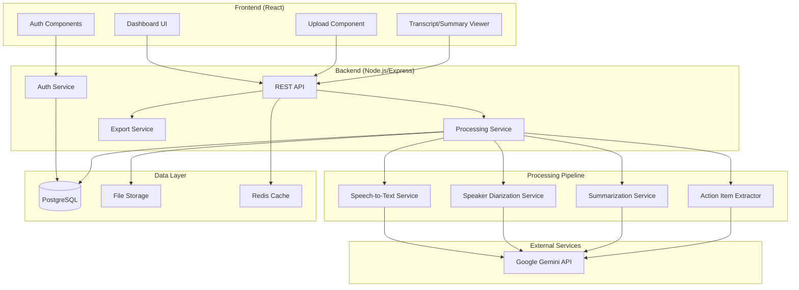

# Design Document: AI Meeting and Lecture Summarizer

## Overview

The AI Meeting and Lecture Summarizer is a web application that processes audio recordings to generate transcripts, summaries, and action items. The system uses a modern web architecture with a React frontend, Node.js backend, and integrates with external AI services for speech-to-text conversion, speaker diarization, and natural language summarization.

The application follows a pipeline architecture where audio files flow through distinct processing stages: upload → transcription → diarization → summarization → action item extraction. Each stage operates asynchronously to handle potentially long-running AI operations without blocking the user interface.

## Architecture



### Architecture Decisions

1. **Asynchronous Processing**: Audio processing is handled asynchronously using a job queue (Bull/Redis) to manage long-running transcription and summarization tasks without blocking API responses.

2. **Google Gemini API**: The system uses Google Gemini API exclusively for all AI functionality including speech-to-text transcription, speaker diarization, summarization, and action item extraction. Gemini's multimodal capabilities allow processing audio directly for transcription and using its language model for NLP tasks.

3. **PostgreSQL for Data**: Relational database chosen for structured data (users, recordings, transcripts) with full-text search capabilities for transcript searching.

4. **File Storage Abstraction**: Audio files stored in a configurable storage backend (local filesystem for development, S3-compatible for production).

### Google Gemini API Integration

The system uses Google Gemini API (`@google/generative-ai` SDK) for all AI-powered features:

**Speech-to-Text Transcription**
- Uses Gemini's multimodal capabilities to process audio files
- Audio is uploaded as inline data or via File API for larger files
- Prompts Gemini to return timestamped transcript segments with confidence scores

**Speaker Diarization**
- Gemini analyzes the transcript and audio to identify distinct speakers
- Returns speaker labels with segment assignments
- Handles multi-speaker conversations with consistent labeling

**Summarization**
- Gemini processes the diarized transcript to generate concise summaries
- Structured prompts ensure summaries include section headings and speaker attributions
- Length constraints enforced via prompt engineering

**Action Item Extraction**
- Gemini identifies tasks, assignments, and deadlines from transcript content
- Returns structured JSON with action item details and transcript references

**Configuration**
```typescript
interface GeminiConfig {
  apiKey: string;
  model: 'gemini-1.5-pro' | 'gemini-1.5-flash';
  maxOutputTokens: number;
  temperature: number;
}
```

## Components and Interfaces

### Frontend Components

#### AuthComponents
- `LoginForm`: Email/password login with validation
- `RegisterForm`: User registration with password requirements
- `PasswordReset`: Password reset request and confirmation

#### DashboardComponents
- `RecordingList`: Paginated list of user's recordings with search/filter
- `RecordingCard`: Individual recording display with status, title, date
- `SearchBar`: Full-text search across recordings and transcripts

#### UploadComponents
- `AudioUploader`: Drag-and-drop file upload with format validation
- `ProgressIndicator`: Real-time upload and processing status

#### ViewerComponents
- `TranscriptViewer`: Full transcript display with speaker labels and timestamps
- `SummaryViewer`: Formatted summary with section headings
- `ActionItemList`: Checklist of extracted action items
- `ExportButton`: Export options dropdown

### Backend Services

#### AuthService
```typescript
interface AuthService {
  register(email: string, password: string): Promise<User>;
  login(email: string, password: string): Promise<AuthToken>;
  validateToken(token: string): Promise<User | null>;
  requestPasswordReset(email: string): Promise<void>;
  resetPassword(token: string, newPassword: string): Promise<void>;
}
```

#### ProcessingService
```typescript
interface ProcessingService {
  initiateProcessing(audioFileId: string): Promise<ProcessingJob>;
  getProcessingStatus(jobId: string): Promise<ProcessingStatus>;
  cancelProcessing(jobId: string): Promise<void>;
}

interface ProcessingJob {
  id: string;
  audioFileId: string;
  status: 'queued' | 'transcribing' | 'diarizing' | 'summarizing' | 'extracting' | 'completed' | 'failed';
  progress: number;
  createdAt: Date;
  completedAt?: Date;
  error?: string;
}
```

#### TranscriptionService
```typescript
interface TranscriptionService {
  transcribe(audioFile: Buffer, format: AudioFormat): Promise<Transcript>;
}

interface Transcript {
  id: string;
  segments: TranscriptSegment[];
  fullText: string;
  duration: number;
}

interface TranscriptSegment {
  startTime: number;
  endTime: number;
  text: string;
  speakerId?: string;
  confidence: number;
}
```

#### DiarizationService
```typescript
interface DiarizationService {
  identifySpeakers(transcript: Transcript, audioFile: Buffer): Promise<DiarizedTranscript>;
}

interface DiarizedTranscript extends Transcript {
  speakers: Speaker[];
  segments: DiarizedSegment[];
}

interface Speaker {
  id: string;
  label: string;
  customName?: string;
}

interface DiarizedSegment extends TranscriptSegment {
  speakerId: string;
}
```

#### SummarizationService
```typescript
interface SummarizationService {
  summarize(transcript: DiarizedTranscript): Promise<Summary>;
}

interface Summary {
  id: string;
  content: string;
  sections: SummarySection[];
  keyPoints: string[];
}

interface SummarySection {
  heading: string;
  content: string;
  speakerAttributions: SpeakerAttribution[];
}

interface SpeakerAttribution {
  speakerId: string;
  statement: string;
}
```

#### ActionItemService
```typescript
interface ActionItemService {
  extractActionItems(transcript: DiarizedTranscript): Promise<ActionItem[]>;
  updateActionItem(id: string, updates: Partial<ActionItem>): Promise<ActionItem>;
}

interface ActionItem {
  id: string;
  description: string;
  assignee?: string;
  deadline?: Date;
  completed: boolean;
  transcriptReference?: {
    segmentId: string;
    startTime: number;
  };
}
```

#### ExportService
```typescript
interface ExportService {
  exportToPDF(recordingId: string): Promise<Buffer>;
  exportToTXT(recordingId: string): Promise<string>;
  exportToDOCX(recordingId: string): Promise<Buffer>;
}
```

### API Endpoints

#### Authentication
- `POST /api/auth/register` - User registration
- `POST /api/auth/login` - User login
- `POST /api/auth/logout` - User logout
- `POST /api/auth/password-reset` - Request password reset
- `POST /api/auth/password-reset/confirm` - Confirm password reset

#### Recordings
- `GET /api/recordings` - List user's recordings (paginated, searchable)
- `POST /api/recordings` - Upload new audio file
- `GET /api/recordings/:id` - Get recording details
- `DELETE /api/recordings/:id` - Delete recording and associated data
- `PATCH /api/recordings/:id` - Update recording metadata (title, speaker names)

#### Processing
- `GET /api/recordings/:id/status` - Get processing status
- `GET /api/recordings/:id/transcript` - Get transcript
- `GET /api/recordings/:id/summary` - Get summary
- `GET /api/recordings/:id/action-items` - Get action items
- `PATCH /api/action-items/:id` - Update action item (mark complete, edit)

#### Export
- `GET /api/recordings/:id/export?format=pdf|txt|docx` - Export recording data

## Data Models

### User
```typescript
interface User {
  id: string;
  email: string;
  passwordHash: string;
  createdAt: Date;
  updatedAt: Date;
}
```

### Recording
```typescript
interface Recording {
  id: string;
  userId: string;
  title: string;
  originalFilename: string;
  fileSize: number;
  duration: number;
  format: 'mp3' | 'wav' | 'm4a' | 'webm';
  storagePath: string;
  status: 'uploading' | 'processing' | 'completed' | 'failed';
  createdAt: Date;
  updatedAt: Date;
}
```

### Transcript
```typescript
interface TranscriptRecord {
  id: string;
  recordingId: string;
  fullText: string;
  segments: TranscriptSegment[];
  speakers: Speaker[];
  duration: number;
  createdAt: Date;
}
```

### Summary
```typescript
interface SummaryRecord {
  id: string;
  recordingId: string;
  content: string;
  sections: SummarySection[];
  keyPoints: string[];
  createdAt: Date;
}
```

### ActionItem
```typescript
interface ActionItemRecord {
  id: string;
  recordingId: string;
  description: string;
  assignee?: string;
  deadline?: Date;
  completed: boolean;
  segmentStartTime?: number;
  createdAt: Date;
  updatedAt: Date;
}
```

### Database Schema

```sql
-- Users table
CREATE TABLE users (
  id UUID PRIMARY KEY DEFAULT gen_random_uuid(),
  email VARCHAR(255) UNIQUE NOT NULL,
  password_hash VARCHAR(255) NOT NULL,
  created_at TIMESTAMP DEFAULT NOW(),
  updated_at TIMESTAMP DEFAULT NOW()
);

-- Recordings table
CREATE TABLE recordings (
  id UUID PRIMARY KEY DEFAULT gen_random_uuid(),
  user_id UUID REFERENCES users(id) ON DELETE CASCADE,
  title VARCHAR(255) NOT NULL,
  original_filename VARCHAR(255) NOT NULL,
  file_size BIGINT NOT NULL,
  duration INTEGER,
  format VARCHAR(10) NOT NULL,
  storage_path VARCHAR(500) NOT NULL,
  status VARCHAR(20) DEFAULT 'uploading',
  created_at TIMESTAMP DEFAULT NOW(),
  updated_at TIMESTAMP DEFAULT NOW()
);

-- Transcripts table
CREATE TABLE transcripts (
  id UUID PRIMARY KEY DEFAULT gen_random_uuid(),
  recording_id UUID REFERENCES recordings(id) ON DELETE CASCADE,
  full_text TEXT NOT NULL,
  segments JSONB NOT NULL,
  speakers JSONB NOT NULL,
  duration INTEGER NOT NULL,
  created_at TIMESTAMP DEFAULT NOW()
);

-- Summaries table
CREATE TABLE summaries (
  id UUID PRIMARY KEY DEFAULT gen_random_uuid(),
  recording_id UUID REFERENCES recordings(id) ON DELETE CASCADE,
  content TEXT NOT NULL,
  sections JSONB NOT NULL,
  key_points JSONB NOT NULL,
  created_at TIMESTAMP DEFAULT NOW()
);

-- Action items table
CREATE TABLE action_items (
  id UUID PRIMARY KEY DEFAULT gen_random_uuid(),
  recording_id UUID REFERENCES recordings(id) ON DELETE CASCADE,
  description TEXT NOT NULL,
  assignee VARCHAR(255),
  deadline TIMESTAMP,
  completed BOOLEAN DEFAULT FALSE,
  segment_start_time INTEGER,
  created_at TIMESTAMP DEFAULT NOW(),
  updated_at TIMESTAMP DEFAULT NOW()
);

-- Full-text search index
CREATE INDEX idx_transcripts_fulltext ON transcripts USING GIN(to_tsvector('english', full_text));
CREATE INDEX idx_recordings_user ON recordings(user_id);
```


## Correctness Properties

*A property is a characteristic or behavior that should hold true across all valid executions of a system-essentially, a formal statement about what the system should do. Properties serve as the bridge between human-readable specifications and machine-verifiable correctness guarantees.*

Based on the acceptance criteria analysis, the following correctness properties must be validated through property-based testing:

### File Upload Validation

**Property 1: File format validation**
*For any* uploaded file, the system should accept the file if and only if its format is in the supported formats list (MP3, WAV, M4A, WEBM)
**Validates: Requirements 1.1, 1.3**

**Property 2: File size validation**
*For any* uploaded file, the system should reject the file if and only if its size exceeds 500MB
**Validates: Requirements 1.2**

**Property 3: File-user association**
*For any* successfully uploaded file, querying the storage should return the file associated with the uploading user's account
**Validates: Requirements 1.5**

### Transcript Processing

**Property 4: Transcript-recording association**
*For any* completed transcript, the transcript should be retrievable by its associated recording ID
**Validates: Requirements 2.2**

**Property 5: Timestamp presence**
*For any* transcript segment, the segment should contain valid start and end timestamps where startTime < endTime
**Validates: Requirements 2.3**

**Property 6: Low confidence marking**
*For any* transcript segment with confidence below the threshold, the segment should be marked as unclear
**Validates: Requirements 2.4**

### Speaker Diarization

**Property 7: Speaker label consistency**
*For any* diarized transcript, each unique speaker ID should map to exactly one speaker label throughout all segments
**Validates: Requirements 3.2**

**Property 8: Speaker name replacement**
*For any* transcript and speaker name mapping, replacing speaker names should update all occurrences of the generic label in both transcript and summary
**Validates: Requirements 3.4**

### Summarization

**Property 9: Summary length constraint**
*For any* transcript and its generated summary, the summary character length should be at most 20% of the transcript character length
**Validates: Requirements 4.2**

**Property 10: Speaker attribution validity**
*For any* speaker attribution in a summary, the referenced speaker ID should exist in the transcript's speaker list
**Validates: Requirements 4.5**

### Action Items

**Property 11: Action item structure**
*For any* extracted action item, the item should contain a non-empty description field
**Validates: Requirements 5.2**

**Property 12: Action item completion toggle**
*For any* action item, toggling its completion status should change the completed field to the opposite boolean value
**Validates: Requirements 5.4**

**Property 13: Transcript reference validity**
*For any* action item with a transcript reference, the referenced segment start time should exist within the transcript's duration
**Validates: Requirements 5.5**

### Dashboard and Data

**Property 14: Recording data completeness**
*For any* recording in the system, the recording should have non-null values for title, createdAt, and status fields
**Validates: Requirements 6.2**

**Property 15: Search result relevance**
*For any* search query and result set, each result should contain the search term in its title, transcript, or match the date range criteria
**Validates: Requirements 6.3**

**Property 16: Cascade deletion**
*For any* deleted recording, querying for its transcript, summary, and action items should return empty results
**Validates: Requirements 6.5**

### Authentication

**Property 17: Password validation**
*For any* password string, the validation should reject passwords that are less than 8 characters, lack mixed case, or lack a number
**Validates: Requirements 7.1**

**Property 18: Authentication success**
*For any* registered user with valid credentials, login should return a valid authentication token
**Validates: Requirements 7.2**

**Property 19: Authentication failure security**
*For any* login attempt with invalid credentials, the error response should not indicate whether the email or password was incorrect
**Validates: Requirements 7.3**

**Property 20: Session expiration**
*For any* expired session token, API requests using that token should be rejected with an authentication error
**Validates: Requirements 7.4**

### Export

**Property 21: Export format correctness**
*For any* export request with a specified format (PDF, TXT, DOCX), the generated file should be valid for that format
**Validates: Requirements 8.1**

**Property 22: Export content completeness**
*For any* exported recording, the export should contain the recording title, date, summary content, and all action items with their assignee and deadline information
**Validates: Requirements 8.2, 8.3**

## Error Handling

### Upload Errors
- **Invalid Format**: Return 400 with list of supported formats
- **File Too Large**: Return 413 with maximum size limit
- **Upload Interrupted**: Clean up partial uploads, allow retry

### Processing Errors
- **Transcription Failure**: Mark recording as failed, store error message, allow retry
- **Diarization Failure**: Continue with single-speaker transcript, log warning
- **Summarization Failure**: Store transcript without summary, allow manual retry
- **Action Extraction Failure**: Store summary without action items, allow manual retry

### Authentication Errors
- **Invalid Credentials**: Return 401 with generic error message
- **Expired Token**: Return 401 with token_expired code
- **Invalid Token**: Return 401 with invalid_token code

### Data Errors
- **Recording Not Found**: Return 404
- **Unauthorized Access**: Return 403
- **Database Connection**: Return 503 with retry-after header

### Export Errors
- **Generation Failure**: Return 500 with error details
- **Unsupported Format**: Return 400 with supported formats list

## Testing Strategy

### Property-Based Testing Framework
The system will use **fast-check** for property-based testing in TypeScript/JavaScript. Each correctness property defined above will be implemented as a property-based test with a minimum of 100 iterations.

Each property-based test must be tagged with a comment in the following format:
```typescript
// **Feature: meeting-summarizer, Property {number}: {property_text}**
```

### Unit Testing
Unit tests will cover:
- Individual service method behavior with specific inputs
- Edge cases for validation functions
- Error handling paths
- Database query correctness

### Integration Testing
Integration tests will verify:
- End-to-end upload and processing flow
- API endpoint behavior
- Authentication flow
- Export generation

### Test Organization
```
tests/
├── unit/
│   ├── services/
│   │   ├── auth.service.test.ts
│   │   ├── upload.service.test.ts
│   │   ├── transcript.service.test.ts
│   │   ├── summary.service.test.ts
│   │   └── export.service.test.ts
│   └── validators/
│       ├── file.validator.test.ts
│       └── password.validator.test.ts
├── property/
│   ├── upload.property.test.ts
│   ├── transcript.property.test.ts
│   ├── summary.property.test.ts
│   ├── action-item.property.test.ts
│   ├── auth.property.test.ts
│   └── export.property.test.ts
└── integration/
    ├── upload.integration.test.ts
    ├── processing.integration.test.ts
    └── auth.integration.test.ts
```

### Mocking Strategy
- Google Gemini API will be mocked in unit and property tests
- Database will use in-memory SQLite for unit tests, test PostgreSQL instance for integration
- File storage will use temporary directories for tests